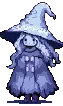

### Hi there! 

I'm Lieann, a computer science student at University of Florida, graduating May 2025

I'm primarily interested in **full-stack development** and currently intern remotely as a software developer.

I love learning new technologies, working with international teams, and streamlining systems and processes through automation.

Outside of work, my interests include exploring new cities, traveling, art and video games.

### Let's connect! 

<!--
**lrazcs/lrazcs** is a ✨ _special_ ✨ repository because its `README.md` (this file) appears on your GitHub profile.

Here are some ideas to get you started:

- 🔭 I’m currently working on ...
- 🌱 I’m currently learning ...
- 👯 I’m looking to collaborate on ...
- 🤔 I’m looking for help with ...
- 💬 Ask me about ...
- 📫 How to reach me: ...
- 😄 Pronouns: ...
- ⚡ Fun fact: ...
-->
